# indeks

## Arkitektur oversikt

```mermaid
graph TD
    %% Eksterne repositorier
    subgraph "Eksterne repositorier"
        SB1_LOGOS[sb1-logos<br/>Statiske filer]
        SB1_FONTS[sb1-fonts<br/>Statiske filer]
        SB1_ICONS[sb1-icons<br/>Statiske filer]
    end

    %% Hovedrepositoriet indeks
    subgraph "Indeks repositorium"
        TOKENS[indeks-tokens<br/>Design tokens]
        UTILS[indeks-utils<br/>CSS utility-klasser]
        CSS[indeks-css<br/>CSS bibliotek]
        WEB[indeks-web<br/>Web components]
        REACT[indeks-react<br/>React komponenter]
        STORYBOOK[indeks-storybook<br/>Komponentworkshop og tester]
        DOCS[indeks-docs<br/>Dokumentasjon]
        EKSEMPEL[indeks-eksempel<br/>Eksempler]
        SHARED[shared<br/>Delte interne verktoy]
    end

    %% Publiseringsdestinasjoner
    subgraph "CDN (cdn.sparebank1.no)"
        CDN_LOGOS[Statiske logoer]
        CDN_FONTS[Statiske fonter]
        CDN_ICONS[Statiske ikoner]
        CDN_CSS[CSS filer]
    end

    subgraph "GitHub Pages (design.sparebank1.no)"
        DOCS_SITE[Dokumentasjonsside<br/>/]
        EKSEMPEL_SITE[Eksempelside<br/>/eksempel]
        STORYBOOK_SITE[Storybook<br/>/storybook]
    end

    subgraph "NPM Registry"
        NPM_TOKENS[indeks-tokens<br/>npm pakke]
        NPM_UTILS[indeks-utils<br/>npm pakke]
        NPM_CSS[indeks-css<br/>npm pakke]
        NPM_WEB[indeks-web<br/>npm pakke]
        NPM_REACT[indeks-react<br/>npm pakke]
    end

    %% Publiseringsflyt
    SB1_LOGOS -->|GitHub Actions| CDN_LOGOS
    SB1_FONTS -->|GitHub Actions| CDN_FONTS
    SB1_ICONS -->|GitHub Actions| CDN_ICONS

    CSS -->|GitHub Actions| CDN_CSS
    DOCS -->|GitHub Pages| DOCS_SITE
    EKSEMPEL -->|GitHub Pages| EKSEMPEL_SITE
    STORYBOOK -->|Storybook bygg| STORYBOOK_SITE

    TOKENS -->|npm publisering| NPM_TOKENS
    UTILS -->|npm publisering| NPM_UTILS
    CSS -->|npm publisering| NPM_CSS
    WEB -->|npm publisering| NPM_WEB
    REACT -->|npm publisering| NPM_REACT

    %% Avhengigheter
    TOKENS -->|byggavhengighet| CSS
    UTILS -->|byggavhengighet| CSS
    CSS -->|avhengighet| EKSEMPEL
    WEB -->|avhengighet| REACT
    REACT -->|avhengighet| EKSEMPEL
    CSS -->|avhengighet| DOCS
    REACT -->|avhengighet| DOCS
    CSS -->|avhengighet| STORYBOOK

    %% Styling
    classDef external fill:#e1f5fe
    classDef indeks fill:#f3e5f5
    classDef cdn fill:#e8f5e8
    classDef github fill:#fff3e0
    classDef npm fill:#fce4ec

    class SB1_LOGOS,SB1_FONTS,SB1_ICONS external
    class TOKENS,UTILS,CSS,WEB,REACT,STORYBOOK,DOCS,EKSEMPEL,SHARED indeks
    class CDN_LOGOS,CDN_FONTS,CDN_ICONS,CDN_CSS cdn
    class DOCS_SITE,EKSEMPEL_SITE,STORYBOOK_SITE github
    class NPM_TOKENS,NPM_UTILS,NPM_CSS,NPM_WEB,NPM_REACT npm
```



## Repositoriestruktur

Dette monorepoet inneholder flere pakker som jobber sammen for å tilby SpareBank 1 sitt designsystem:

-   **indeks-tokens**: Design tokens (farger, spacing, typografi) publisert som npm pakke
-   **indeks-utils**: CSS utility-klasser publisert som npm pakke (inlines i indeks-css)
-   **indeks-css**: CSS bibliotek bygget fra tokens og utils, publisert til npm og CDN
-   **indeks-web**: Web components (custom elements), publisert som npm pakke og til CDN
-   **indeks-react**: React komponentbibliotek (tynne wrappere over indeks-web) publisert som npm pakke
-   **indeks-storybook**: Komponentworkshop og visuelle/a11y-tester (privat, publiseres ikke)
-   **indeks-docs**: Dokumentasjonsside publisert til GitHub Pages
-   **indeks-eksempel**: Eksempelimplementasjoner publisert til GitHub Pages
-   **shared**: Delte interne bygg-/konfigverktøy (privat, publiseres ikke)

## Kjøre opp prosjektet

Prosjektet bruker pnpm workspaces for å gjøre det enkelt å utvikle.
For å starte å utvikle installerer du prosjektet med:

`pnpm install`

kjør så

`pnpm build`

for å bygge de statiske resursene. På sikt vil de også tilby en dev alternativ så en slipper dette steget.

`pnpm dev` starter opp docs, eksempel og storybook.

`pnpm update-packages` gir deg en `ncu` interactiv view for å oppdatere pakker.

## Versjonering og Release

Prosjektet bruker [Changesets](https://github.com/changesets/changesets) for versjonshåndtering og publisering.

### Lokalt: Legge til endringer

Når du har gjort endringer som skal publiseres:

```bash
pnpm changeset
```

Dette starter en interaktiv wizard som:

1. Lar deg velge hvilke pakker som er endret
2. Velge bump-type (major, minor, patch)
3. Skrive en kort beskrivelse av endringen

Changesets lagres i `.changeset/` mappen og committes til git.

### Lokalt: Publisere en release

For å publisere en ny versjon (krever npm-tilgang):

```bash
pnpm release
```

Dette kjører:

1. `changeset version` - Oppdaterer versjonsnumre i package.json basert på changesets
2. `pnpm build` - Bygger alle pakker med de nye versjonsnumrene
3. `changeset publish` - Publiserer til npm og oppretter git tags

**Viktig:** CSS-pakken bygges med `CDN_BUILD=true` for å injisere korrekte CDN-URLer med versjonsnumre.

### GitHub Actions (automatisert)

Når endringer pushes til main branch:

-   Bygger alle pakker
-   Deployer dokumentasjon til GitHub Pages
-   Deployer Storybook til GitHub Pages
-   (Fremtidig) Publiserer CSS til CDN (cdn.sparebank1.no)

Versjonsbumping og npm-publisering gjøres manuelt lokalt for kontroll.

### Versjoneringsregler

-   **indeks-tokens** og **indeks-utils**: Independent versioning (kan ha ulike versjoner)
-   **indeks-css**, **indeks-web** og **indeks-react**: Fixed versioning (alltid samme versjon)
-   Interne avhengigheter: når tokens/utils oppdateres, får indeks-css et patch-bump automatisk (`updateInternalDependencies: "patch"`), og web/react følger med som del av fixed-gruppa
